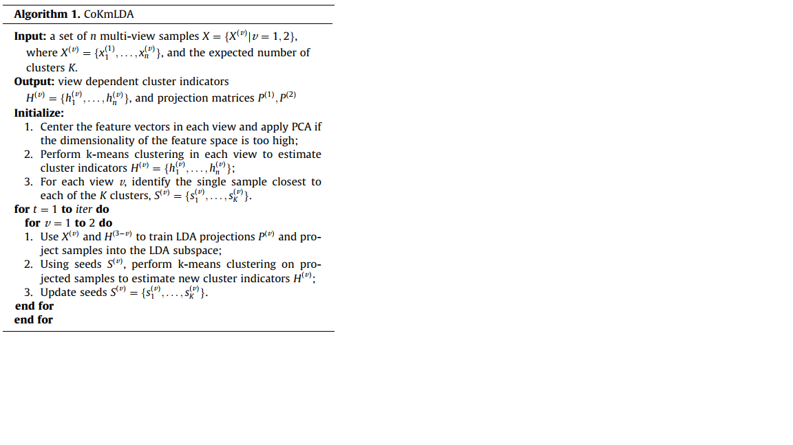

## The note on "A subspace co-training framework for multi-view clustering"

### Main idea

The objective of this paper is to employ co-training algorithms to achieve consensus among divergent perspectives. The core idea is described as following,

- **to train LDA using lable information from another view and perform projection by matrix that is obtained by LDA**.  use $X^{(v)}$ and $H^{(3-v)}$ (label from another view) to train LDA projection matrix $P^{(v)}$, and project all samples into a new representation guaided by the matrix  $P^{(v)}$.

- **to update new assignment for each item**. perform k-means clustering on projected samples with initilized k-centers $S^{(v)}$. then update label information $H^{(v)}$ and new k-centers $S^{(v)}$.

Firstly, the authors define a criterion for evaluating the degree of consensus, i.e.,

$$
\textrm{CAI}(H^{(1)},H^{(2)})\triangleq\frac1n \sum_{i=1}^n\delta(h_i^{(1)},\textrm{map}(h_i^{(2)}))
$$

Then, seek two LDA projections $P^{(1)},P^{(2)}$ such that the CAI resulting from k-means on both subspaces is maximized.

$$
\arg\max\limits_{P^{(1)},P^{(2)}} \textrm{CAI}(H^{(1)},H^{(2)})
$$

where $H^{(v)}$s are further dependent on $P^{(v)}$s,

$$
H^{(v)}=\arg\min\limits_{H^{(v)}}\sum_{k=1}^K\sum_{h_i^{(v)}=k}\Vert P^{(v)\top}\pmb{x}_i - P^{(v)\top}\pmb{m}_k\Vert^2;\quad (v=1,2)
$$

Co-training: the method use cluster indicators generated by k-means in one view as label information to train LDA projections in the other view, and vise versa.

### Comparsion with other papers

- **advantages**. not complicated.

- **defects**.  

  - It is difficult for the algorithm to reach a balance between all views, when the number of views more than 3.
  - The convergence of the algorithm is not guaranteed.

### My idea

## References

- [Zhao2014] Xuran Zhao, Nicholas Evans, Jean-Luc Dugelay. *A subspace co-training framework for multi-view clustering*. **Pattern Recognition Letters**, 2014.