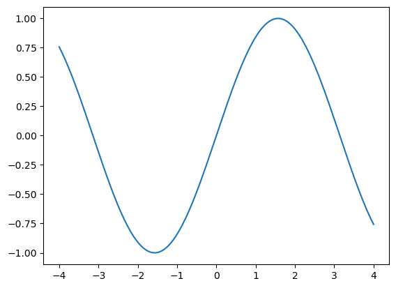

### 观察Python演示代码的运行结果

&emsp;&emsp;用以下Python代码画一个正弦函数的图像。


```python
import numpy as np
from matplotlib import pyplot as plt

x = np.linspace(-4,4,200)
y = np.sin(x)

plt.plot(x,y)
plt.show()
```


    

    


